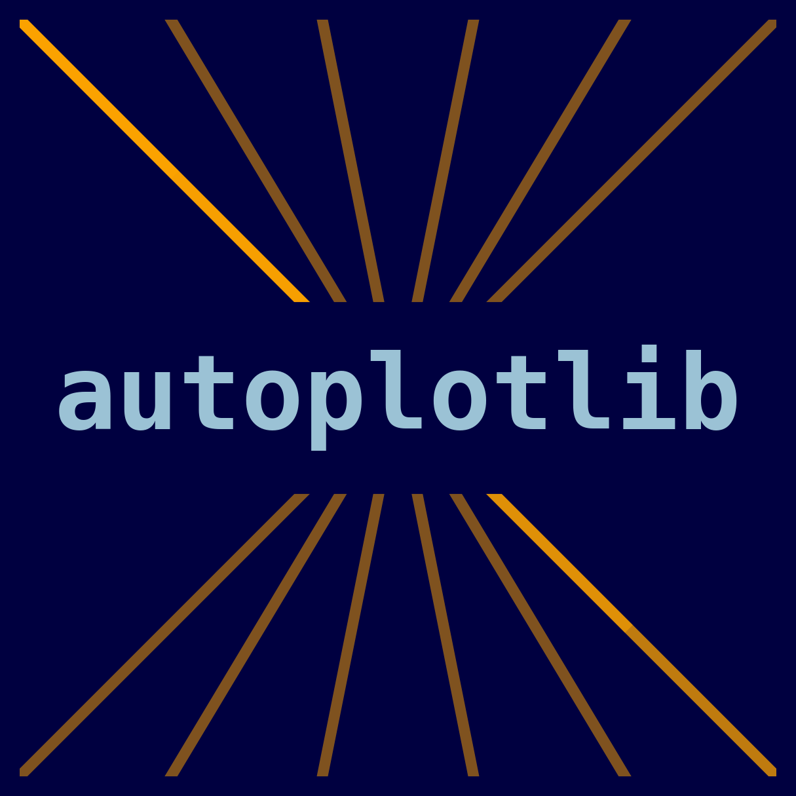
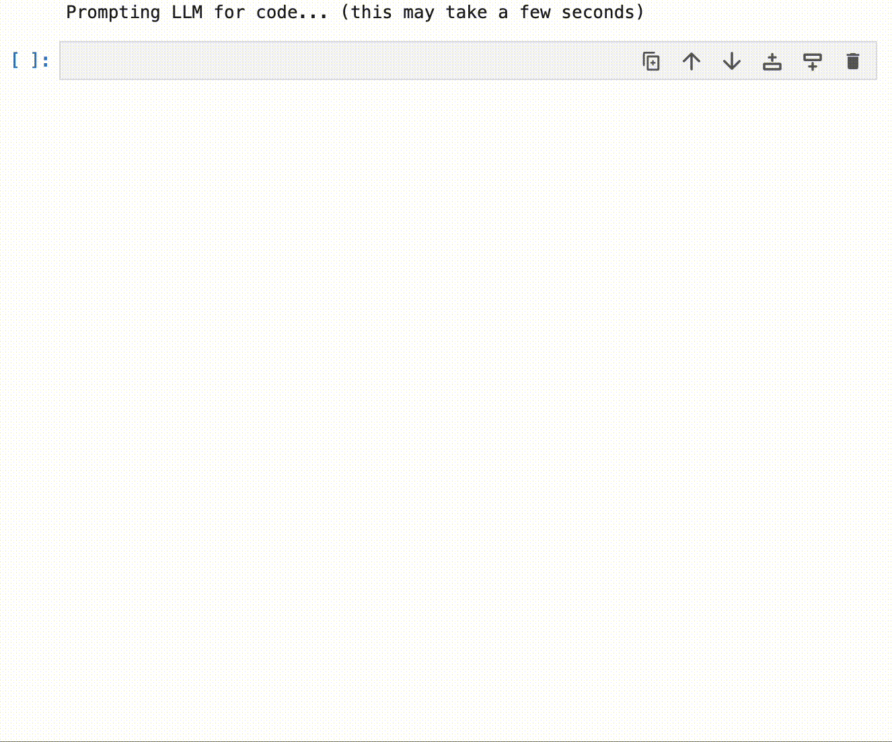

<p align="center">

</p>

# autoplotlib

*Quickly generate plots in Python by simply describing them through text.* For example, simply use the prompt "create a scatter plot with name labels" instead endlessly searching the docs and stackoverflow. Given such a prompt, the `autoplotlib` Python library uses the OpenAI API to automatically generate the corresponding code and plot - saving you time and effort.

> **Warning**
> This package is experimental. The package can execute code output from language models. Albeit unlikely, always check and confirm no malicious code was generated by the model before execution. Use at your own risk.

## Installation

1. Install the Python package:
    ```
    pip install autoplotlib
    ```
2. Get an OpenAI API key by [signing up here](https://platform.openai.com/overview) if you don't have one already.


## Usage

The following is an example of plotting a pandas dataframe using the `autoplotlib` library. The `plot()` function takes a prompt describing the plot and the data to plot. The function returns the plot, the generated code, and the full response from the OpenAI API.

```python
# set the OpenAI API key
import os
os.environ["OPENAI_API_KEY"] = "<YOUR_API_KEY>"

import autoplotlib as aplt
import pandas as pd

data = pd.DataFrame(
    [[29, 177], [33, 186], [48, 161], [53, 173], [67, 152]],
    index=["Alice", "Bob", "Charlie", "Dave", "Eve"],
    columns=["age", "height"],
)

figure_description = """
Plot the data as scatterplot between height and age.
Add the names as labels next to the data points.
Ensure the labels don't overlap.
Mark people taller than 170 with a star instead of a point.
"""

code, fig, llm_response = aplt.plot(figure_description, data=data)
```



## Development

### Setup

1. Fork the repository.

2. Clone the repository:
    ```
    git clone <yourforkpath>
    ```

3. Install the package in development mode:
    ```
    pip install -e ".[dev]"
    ```

## TODOs

- [ ] Add sandboxing of code execution ([see here](https://stackoverflow.com/questions/3068139/how-can-i-sandbox-python-in-pure-python#3068475))

## License

[MIT License](./LICENSE)
